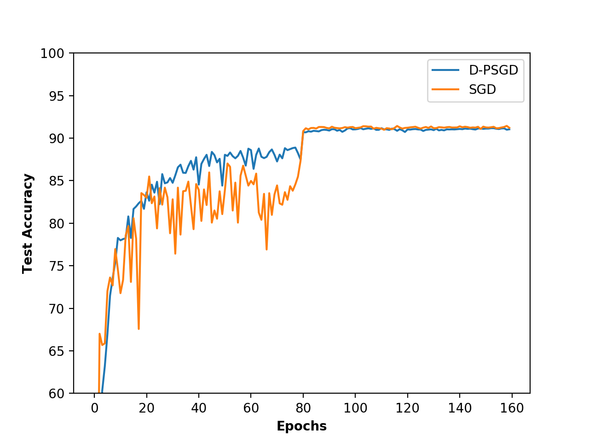

# D-PSGD
Algorithm: Decentralized Parallel Stochastic Gradient Descent   
* Follow paper [Can decentralized algorithms outperform centralized algorithms? a case study for decentralized parallel stochastic gradient descent (Lian et al. 2017)](http://papers.nips.cc/paper/7117-can-decentralized-algorithms-outperform-centralized-algorithms-a-case-study-for-decentralized-parallel-stochastic-gradient-descent.pdf) 
## Requirements
- Install PyTorch ([pytorch.org](http://pytorch.org))
- GPU clusters with OpenMPI to communicate
## Training
A 20-layer ResNet model and Cifar10 dataset are choosed for evaluation. Use the code bellow to start a training process on 1 coordinator node and 4 training nodes.
```bash
mpirun -n 5 --hostfile hosts python PSGD.py --epochs 160 --lr 0.5
```
## Results
Top1 accuracy rate on test dataset is shown below.


